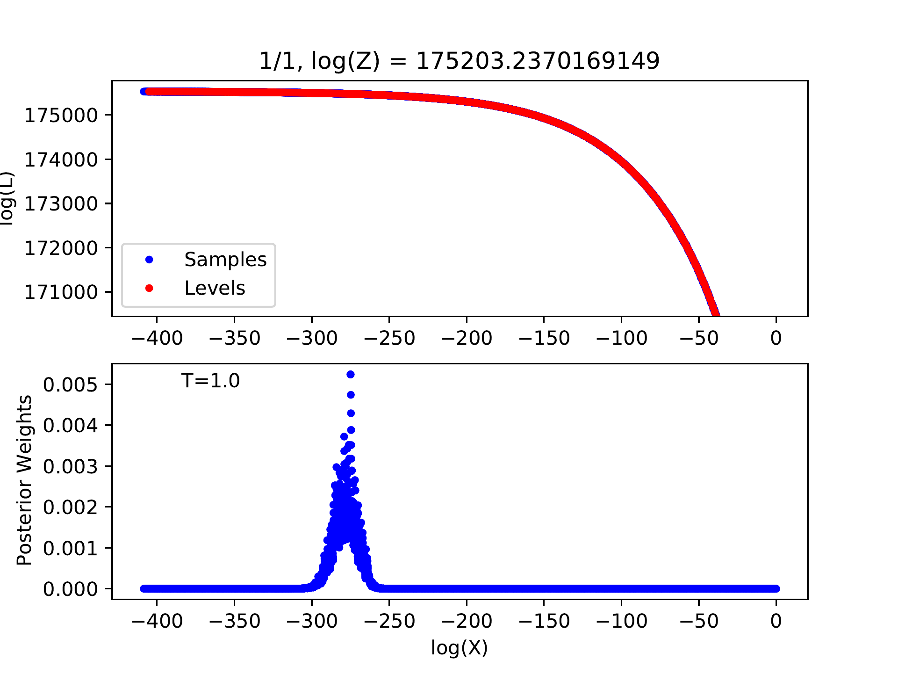
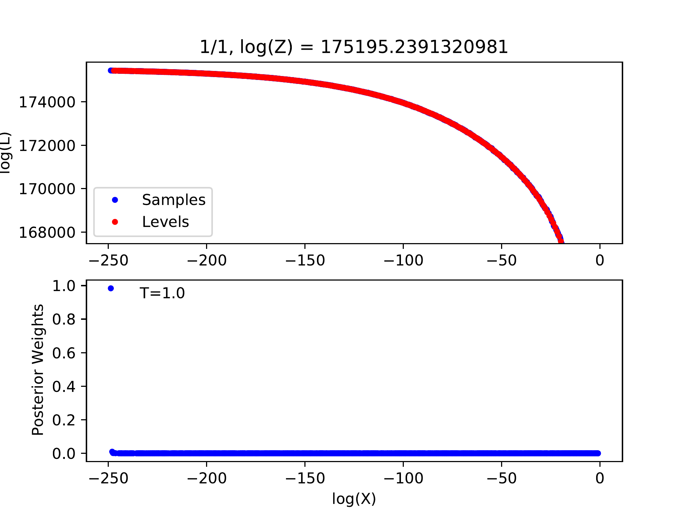
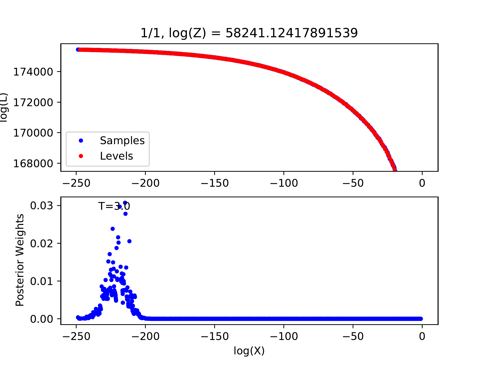

***************
Nested Sampling
***************
``trains`` employs the diffusive nested sampling algorithm developed by Brendon J. Brewer (https://github.com/eggplantbren/DNest3).
We write a C version of the algorithm, dubbed as ``CDNest``.  ``CDNest`` needs to input some options.

The format of option file for CDNest looks like as follows::

  # File containing parameters for CDNest
  # Put comments at the top, or at the end of the line.
  # Lines beginning with '#' are regarded as comments.

  NumberParticles             2          # Number of particles
  NewLevelIntervalFactor      1.00       # New level interval factor
  SaveIntervalFactor          1.00       # Save interval factor
  ThreadStepsFactor           10.00      # ThreadSteps factor
  MaxNumberLevels             0          # Maximum number of levels
  MaxNumberSaves              10000      # Maximum number of saves
  PTol                        2.0e-01    # Likelihood tolerance in loge

The option file for pulsar timing residuals reconstruction is ``options/OPTIONSPT``. 
``trains`` will automatically reads these options appropriately.

Lines beginning with '\#' are regarded as comments. 
There is not a general rule to set the values of options. 
The most important options are the options for new level interval and maximum number of levels. 
Sufficiently large values will work better, but also will cause extra computation time. 
The option for maximum number of saves controls the length of the Markov chains. 
Note that this is not the length of the final posterior sample. 

.. note::
  If the new level interval is not specified explicitly in the option file, it will be determined by 
  the product of the number of particles, the new level interval factor, the thread steps factor, 
  the number of parameters in the model and the total number of threads.
  If the maximum number of levels is not specified, it will be built up continually until the difference of log-likelihoods 
  of adjacent levels is less than the likelihood tolerance.

To check whether the values of options are appropriate, one may run 

.. code:: bash

  python postprocess.py -t 1

in the ``analysis`` subdirectory to inspect the log-likelihood-curve; 
see also the user manual in the package DNest3 developed by Brendon J. Brewer, which is available at https://github.com/eggplantbren/DNest3.

  
  Example for log-likelihood curve of a good run with appropriate options.

  
  Example for log-likelihood curve of a bad run with inappropriate options.
  
  
If there is no peak in the posterior weights, the number of levels must be insufficient, 
indicating that we have not reached the level containing the most posterior probability.
We can introduce a temperature parameter :math:`T` and flatten the probability distribution by 
modifying the likelihood of each level :math:`L_j` to :math:`L_j\exp(-T)`.
The number of levels may be sufficient for this flattened probability distribution 
and the corresponding posterior sample will be produced.
Certainly, the uncertainties of model parameters will be overestimated in this way.

Run 

.. code:: bash

  python postprocess.py

will set the appropriate temperature automatically.

  
  Example for log-likelihood curve with larger temperature.