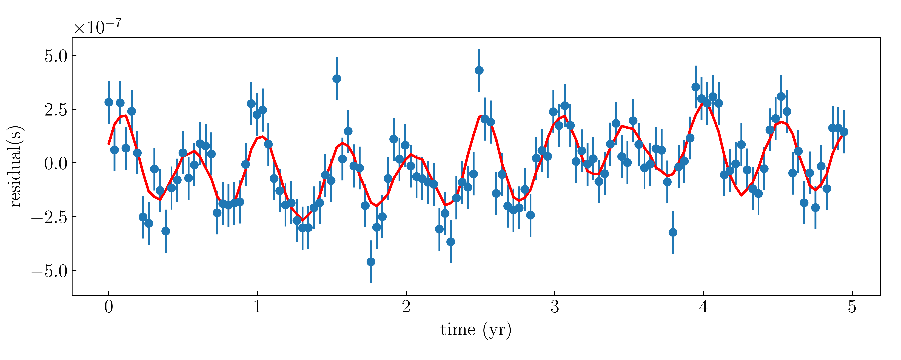
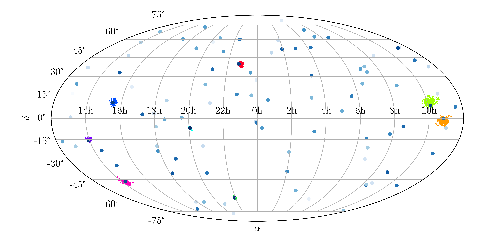

**************************
Fitting to Data
**************************

The code can fit the signal model to the data of timing residuals by setting ``FlagRec`` to 1 in parameter file (see :ref:`Parameter File`).

The major output data files are ``posterior_sample_pt.txt``, ``ptr_rec.txt`` and ``pptr.txt`` in the subdirectory ``data/``.

* ``posterior_sample_pt.txt`` is the posterior sample of all model parameters, and i-th column corresponds to the i-th parameter in the model.
* ``ptr_rec.txt`` is reconstructed timing residuals by model parameters given in ``posterior_sample_pt.txt``.
  It has :math:`N_{\rm t}` columns and :math:`N_{\rm ps} N_{\rm p}` rows, 
  where :math:`N_{\rm t}` is the the number of data points in timing residuals of each pulsar,
  :math:`N_{\rm p}` is the number of pulsars and :math:`N_{\rm ps}` is the size of the sample.
  Row :math:`1` to row :math:`N_{\rm p}` is the reconstructed timing residuals using the first set of parameters in the sample, and so on.
  The observation times of timing residuals is the same as that of the input data and so neglected here.
* ``pptr.txt`` is predicted timing residuals using the mean of each parameter of the sample. 

Run 

.. code:: bash

  python plot_rec.py

in the ``analysis`` subdirectory will output figures ``residual.pdf``, ``skymap.pdf`` and ``corner_i.pdf``.

* ``residual.pdf`` is the plot of reconstructed pulsar timing residuals of each pulsar.
* ``skymap.pdf`` is the posterior distribution of sources' locations on the celestial sphere.
* ``corner_i.pdf`` is the probability distributions of model parameters of the i-th source.

  
  Example for reconstructed timing residuals of a pulsar. 
  The red line is the reconstructed timing residuals with smallest chi-square.

  
  Example for the posterior distribution of eight sources' locations on the celestial sphere.

.. figure:: _static/corner_0.png
  :align: center

  Example for the probability distributions of model parameters of the source with lowest orbital angular frequency.
