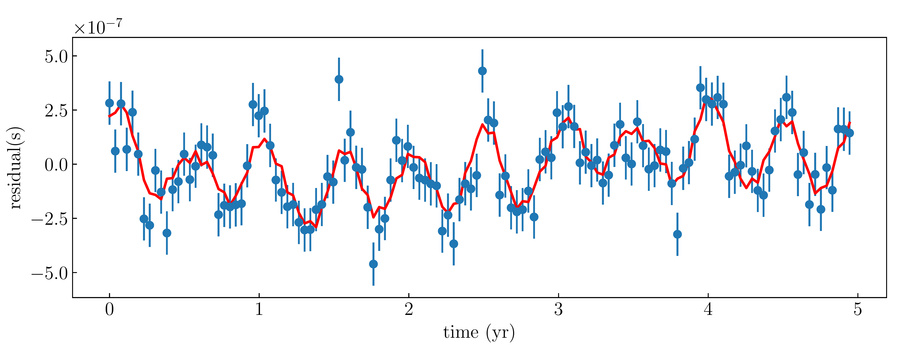
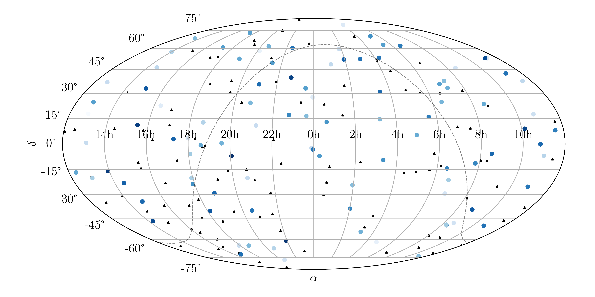

**************************
Generating Simulation Data
**************************

The code can generate simulation data by setting ``FlagRec`` to 0 in parameter file (see :ref:`Parameter File`).

The output simulation data files are ``sim_ptr.txt``, ``sim_signal.txt``, ``sim_source.txt``, ``sim_phase.txt`` and ``sim_snr.txt`` in the subdirectory ``data/``.

* ``sim_ptr.txt`` is the simulated pulsar timing residuals, whose format is described in :ref:`Data Format`.
* ``sim_signal.txt`` is the corresponding noiseless pulsar timing residuals.
* ``sim_source.txt`` is model parameters of close binaries of supermassive black holes randomly generated.
  It contains eight columns, which represent right ascension (rad), sine of declination, cosine of inclination, 
  polarization (rad), initial orbital phase (rad), logarithm of initial orbital angular frequency (rad per year) and 
  logarithm of merging time (year).
* ``sim_phase.txt`` contains pulsar phase parameters. It has :math:`N_{\rm s}` rows and :math:`N_{\rm p}` columns, 
  where :math:`N_{\rm s}` and :math:`N_{\rm p}` are numbers of sources and pulsars respectively.
  The value in i-th row and j-th column is the pulsar phase of j-th pulsar to the i-th source.
* ``sim_snr.txt`` is the signal-to-noise ratio of each source.

Run 

.. code:: bash

  python plot_sim.py

in the ``analysis`` subdirectory will output figures ``residual_sim.pdf`` and ``skymap_sim.pdf``.

* ``residual_sim.pdf`` is the plot of simulated pulsar timing residuals of each pulsar.
* ``skymap_sim.pdf`` is the distribution of pulsars and sources on the celestial sphere.

  
  Example for simulated timing residuals of a pulsar. The red line is the noiseless signal.

  
  Example for distribution of simulated pulsars and sources on the celestial sphere.
  The blue points and black triangles are sources and pulsars respectively.
  The depth of the blue color indicates the SNR of the source.
  